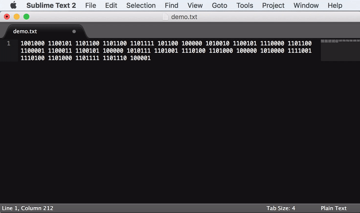

## Sublime Text "Replace with Python"

Sublime Text has a great regex-powered find-and-replace feature. But, what if you want to do a little more complex replacement? "Replace with Python" empowers your replace command with Python, letting you do advanced text manipulation intuitively and easily.

## Commands

- "With Python: Replace", accessible as `Find => Replace with Python` (`with_python_prompt_replace`)
    1. Select some regions of text, e.g. by alt+dragging a rectangular area or by using  `Find => Find...` followed by alt+enter to select all matches.
    2. Activate this command to bring up a command entry box
    3. Type a Python statement (or multiple statements separated by newlines, which you can enter with `alt+enter`), which uses the `text` and/or `index` variables and ultimately assigns the `text` variable.
    4. Your snippet will be executed once per selection region, with the output `text` variable replacing the selected text.
- "With Python: Sort Lines", accessible as `Edit => Sort Lines with Python` (`with_python_prompt_sort_lines`)
    1. Optionally, select some regions of text. Each region will be sorted independently. The entire file is sorted if nothing is selected.
    2. Activate this command to bring up a command entry box.
    3. Type a Python expression which uses the `line` and/or `index` variables. The result of this expression is used as a sort key.
    4. The expression is executed once per line in a selection region, and the lines are sorted according to the resulting values.
- "With Python: Sort Selections", accessible as `Edit => Sort Selections with Python` (`with_python_prompt_sort_selections`)
    1. Select some regions of text.
    2. Activate this command to bring up a command entry box
    3. Type a Python expression which uses the `text` and/or `index` variables.
    4. The expression is executed once per selection region, and the regions are moved according to the resulting values. Unselected text is not affected.

## Variables

- `text` - Selected text. Usable in `Replace With Python` and `Permute Selections => Sort With Python`.
- `line` - Line within a selection. Usable in `Permute Lines => Sort With Python`.
- `index` - 0-based index of the current selection region. Usable in all functions.
- `lineno` - Line number within the current selection. Usable in `Permute Lines => Sort With Python`.
